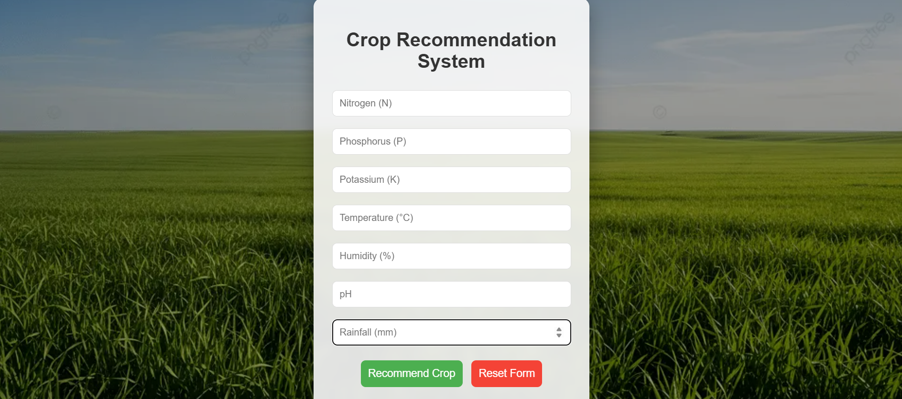
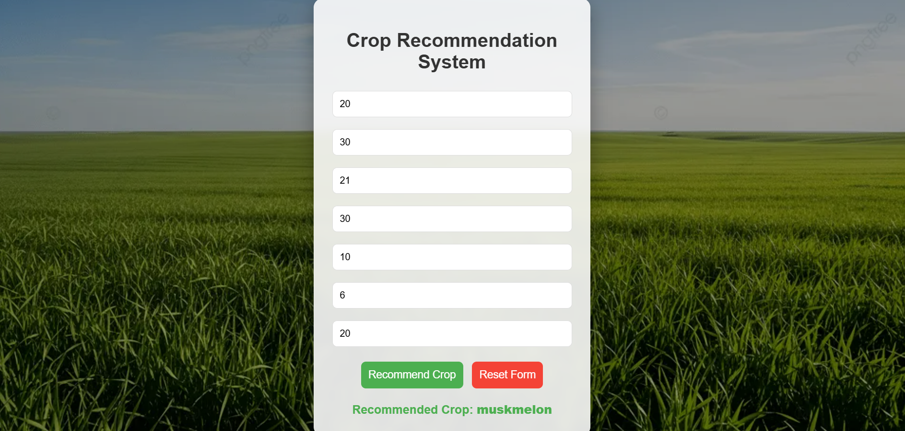

# Crop Recommendation System 🌾

A user-friendly web application that recommends the most suitable crop to grow based on soil nutrients (N, P, K), temperature, humidity, pH, and rainfall. Built with **Python**, **Flask**, **scikit-learn** (Random Forest Classifier), and a clean HTML/CSS/JavaScript frontend..

This project helps farmers (especially in regions like Sri Lanka) make data-driven decisions for better yield and sustainable farming..

## Features
- **Accurate Crop Prediction** — Uses a trained Random Forest model (~99% accuracy on test data).
- **Beautiful Responsive Interface** — Modern form with gradient background, reset button, and real-time prediction display.
- **Data Preprocessing & Model Training** — Separate scripts for preprocessing, training, and testing.
- **Weather Integration Ready** — Code hooks for free APIs like OpenWeatherMap (auto-fetch Colombo/Negombo weather).
- **Reset Form Button** — Clears inputs and result easily
- **Modular Structure** — Easy to extend (e.g., add fertilizer recommendation, market prices)
## Demo Screenshots

Here are visual examples of the Crop Recommendation System in action:

### 1. Empty Form (Clean State – No Input Entered)


*Screenshot showing the initial state: All input fields are blank, ready for user data entry. Includes the "Recommend Crop" and "Reset Form" buttons.*

### 2. After Prediction (With Recommendation & Weather Info)


*Screenshot showing a filled form, successful prediction (e.g., "Recommended Crop: rice"), and optional weather integration display for Negombo/Colombo area.*

> **Note**: Add your own screenshot here!  
> How to create one:  
> 1. Run the app (`python app.py`)  
> 2. Open http://127.0.0.1:5000 in your browser  
> 3. Enter sample values (e.g., N=90, P=42, K=43, temp=25, humidity=80, pH=6.5, rainfall=200)  
> 4. Take a screenshot of the page after prediction (crop shown + weather bonus if integrated)  
> 5. Crop it nicely (remove browser tabs/taskbar)  
> 6. Save as `screenshots/app_screenshot.png` (create `screenshots/` folder if needed)  
> 7. Commit & push to GitHub — the image will display in README.


## Technologies Used
- **Backend**: Python, Flask, scikit-learn, pandas, numpy, joblib
- **Frontend**: HTML5, CSS3 (with gradient & blur effects), JavaScript (Fetch API)
- **Model**: RandomForestClassifier (ensemble method – robust & high accuracy)
- **Dataset**: [Crop Recommendation Dataset](https://www.kaggle.com/datasets/atharvaingle/crop-recommendation-dataset) (~2200 rows, 22 crops)

## Installation & Setup
1. Clone the repository:
   ```bash
   git clone https://github.com/your-username/crop-recommendation-system.git
   cd crop-recommendation-system.
